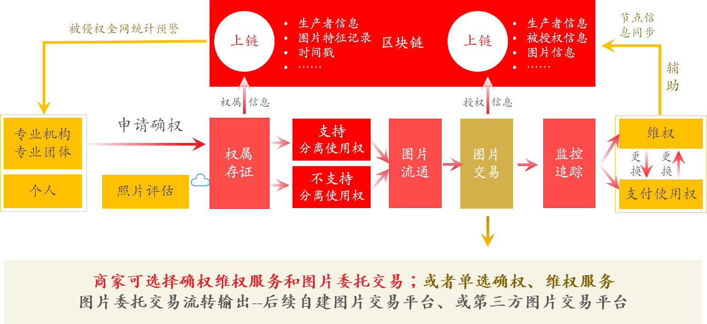
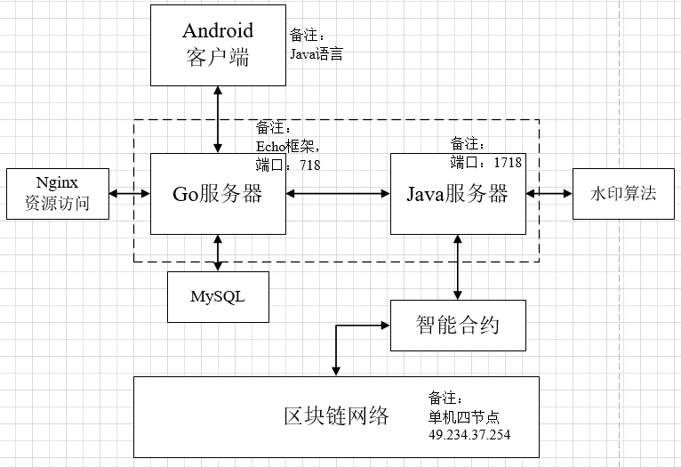

# 基于区块链的文创设计策展社区和版权确权流通平台

## 产品介绍

项目为基于区块链的文创设计策展社区和版权确权流通平台。项目依托一个社交化的文创交流社区，该社交化平台搭建完成后，文创产品的设计者可以上传自己的原创设计进行展示，社区用户可以对每个文创的设计进行打分，根据社交化平台上面的热度、评分、分享量等数据，设计一个对产权的估价算法。与此同时，项目还希望实现基于区块链的文创产品设计版权的确权流通系统，实现版权的数字化、上链并生成NFT、交易支付等功能。估价的结果会作为版权数字化流通时的参考交易价格。

<div  align="center">

</div>

## 产品功能

该产品主要有如下功能：

#### 1. 确权功能—数字内容素材唯一身份标识

通过自主知识产权的确权水印技术提取数字内容素材的特征信息，为其生成全网唯一的身份标识。该技术可抵抗旋转、扭曲、裁剪、涂改等操作对数字内容素材带来的影响，确保数字内容原始素材与被修改素材身份标识的一致。

#### 2. 溯源功能—数字内容素材追踪器

通过在数字内容素材中嵌入自主知识产权的溯源水印，打造不可修改的数字追踪器。利用嵌入的溯源水印可以快速确认素材原始归属、素材交易历史与素材现有归属。因此，可快速发现侵权行为、定位侵权主体、输出链上侵权证据，为发起侵权链上司法公证提供技术基础。

#### 3. 隐私保护下的安全交易功能

针对数字内容素材交易过程中暴露的隐私泄露与不诚实问题，基于加解密与智能合约技术，实现分布式场景下多方公平交易功能，确保用户间交易内容的不可篡改、交易行为的不可抵赖与交易过程的隐私安全。

## 技术架构

技术架构如下所示：



## 操作手册

其运行步骤，详见操作手册


### 备注

涉及机密数据，需要回撤版本时，对git操作：

```shell
使用：git reset --hard HEAD^
如：
git reset --hard 需回退的版本id

需要回退的id，通过 ：
git log
查看

最后，push上云端：
git push --force
```

